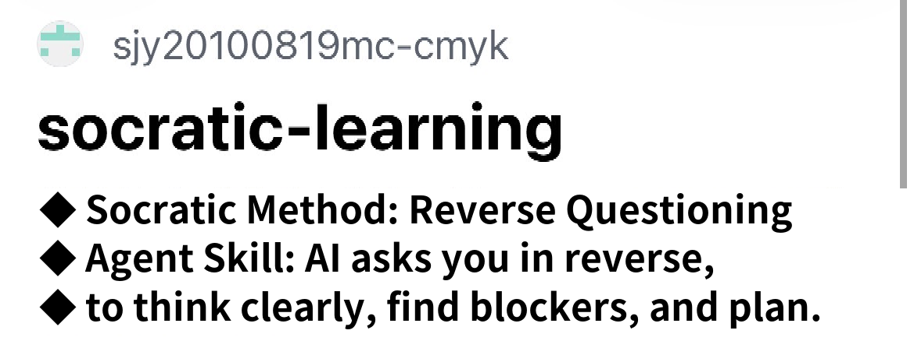
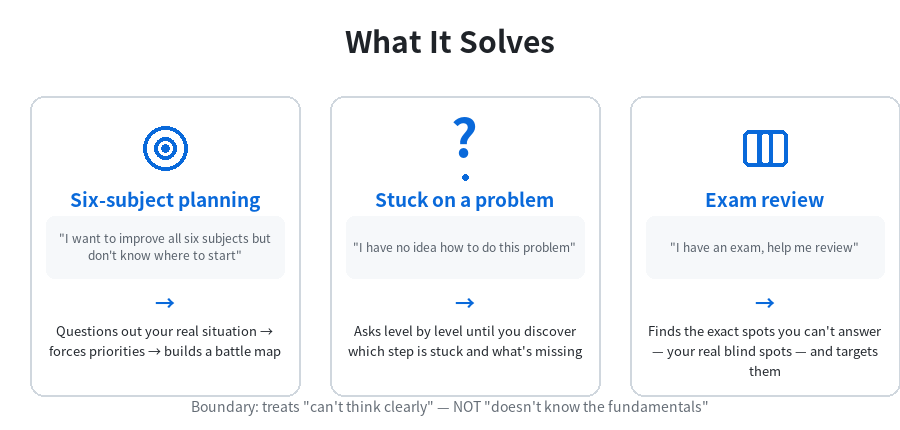
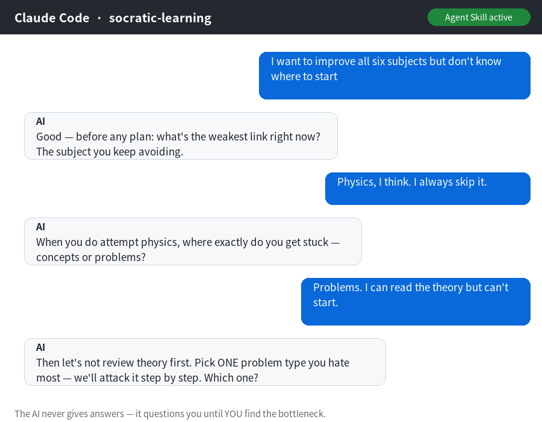
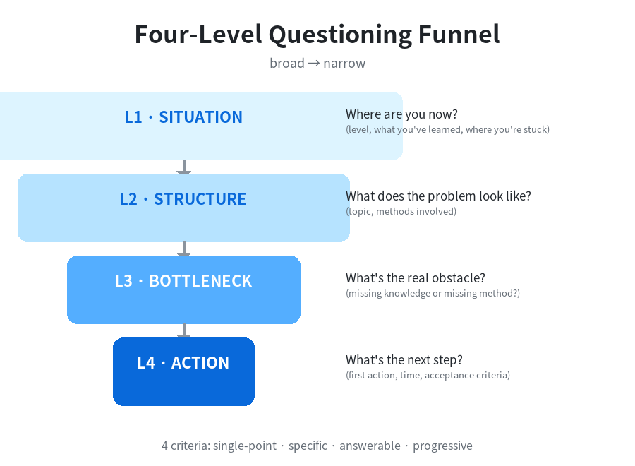

# Socratic Learning — "Reverse Questioning" Agent Skill



> Let the AI question *you* instead — turn an "answer machine" into a "strategy advisor".

An **Agent Skill** for the moments when your thinking is messy, you have no direction, or you're stuck.
Instead of giving answers, the AI **flips the script** and leads the conversation with a series of sharp,
probing questions — guiding you to clarify your own thinking, break down the problem, find the real
bottleneck, and co-create an **actionable plan**.

Inspired by the viral "AI reverse operation" TikTok technique, battle-tested in high-school exam prep
(all subjects), and equally useful for career choices, decision-making, and review.

---

## What It Solves

| Scenario | Default AI behavior | This Skill's behavior |
|----------|--------------------|-----------------------|
| "I want to improve all six subjects but don't know where to start" | Dumps a plan on you | Questions out your real situation → forces out your priorities → builds a battle map together |
| "I have no idea how to do this problem" | Walks through the solution | Asks level by level until you discover for yourself which step is stuck and what's missing |
| "I have an exam, help me review" | Lists knowledge points | Finds the exact spots you can't answer — your real blind spots — and targets them |



**Core boundary**: treats "can't think clearly", NOT "doesn't know the fundamentals" — explain the
principle first when concepts aren't memorized; answer directly when an answer is explicitly requested.

## Quick Start

### Install as an Agent Skill

Drop the `socratic-learning/` folder into your agent's skills directory (e.g. `~/.claude/skills/`,
`/var/minis/skills/`), or have the agent read `SKILL.md`.

### Use Without Installing

Copy any prompt from `references/prompts.md` to any AI and it works immediately.



## Structure

```
socratic-learning/
├── SKILL.md                        # Core: when to use, four-level funnel, safety rails
├── references/
│   ├── prompts.md                  # 6 ready-to-use scenario prompts (copy-paste)
│   └── question-bank.md            # question templates by funnel level
└── examples/
    └── demo-conversation.md        # full example conversation + technique breakdown
```

## Core Methodology

**The Four-Level Questioning Funnel** (broad to narrow):



```
Level 1 · Situation    Where are you now? (level, what you've learned, where you're stuck)
   ↓
Level 2 · Structure    What does the problem look like? (topic, methods involved)
   ↓
Level 3 · Bottleneck   What's the real obstacle? (missing knowledge or missing method?)
   ↓
Level 4 · Action       What's the next step? (first action, time, acceptance criteria)
```

**4 criteria for good questions**: single-point (one at a time) · specific · answerable (an unanswerable
question IS a signal) · progressive (each answer adds information).

**Safety rails**: 2 consecutive unanswerable questions = real bottleneck, switch to explaining; question
limit 6-8 rounds; when the user is upset or in a hurry, converge to action fast.

## Inspiration

- The viral "AI reverse operation" TikTok technique
- The Socratic method (guiding through questioning rather than lecturing)

## License

MIT © 2026 sjy20100819mc-cmyk
